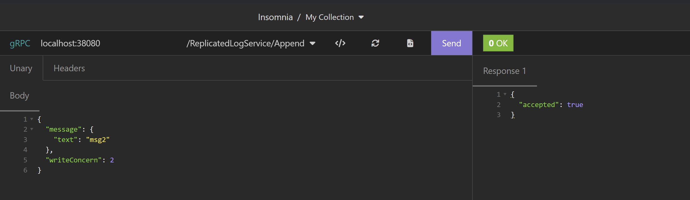
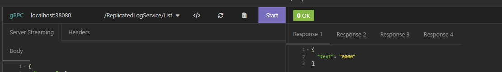
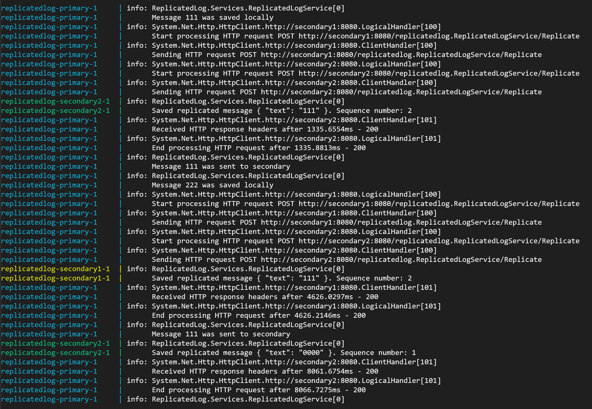

## Replicated Log

### Run
```
docker compose up --build
```

### Test
Docker compose exposes 38080 port for Primary and 38081, 38082 ports for secondaries.
###### Append message

###### List on primary

###### List on secondary 1

###### List on secondary 2


More secondaries can be added by adding more secondary services and changing primary environment variables in [docker-compose.yml](./ReplicatedLog/docker-compose.yml) file.

### Random delays
Secondaries respond with random delay on Append, from 0 to 20000 ms (configurable in docker-compose).


Despite the delay, total order of messages is the same on all instances, and deduplication of replicated messages is implemented on secondaries.

### Retry logic
If a secondary does not respond in ReplicationTimeoutMs, primary waits for some time and retries.

### Heartbeat
Primary keeps track of secondaries health. Health endpoint returns status of each secondary. Here are the statuses:
```
enum HeartbeatStatus {
	Unknown = 0;
	Healthy = 1;
	Suspected = 2;
	Unhealthy = 3;
}
```

If Heartbeat Status of a secondary is Unhealthy or Unknown (initial), primary doesn't send requests to it.


### Quorum
If there is no quorum, primary doesn't accept Append requests.
